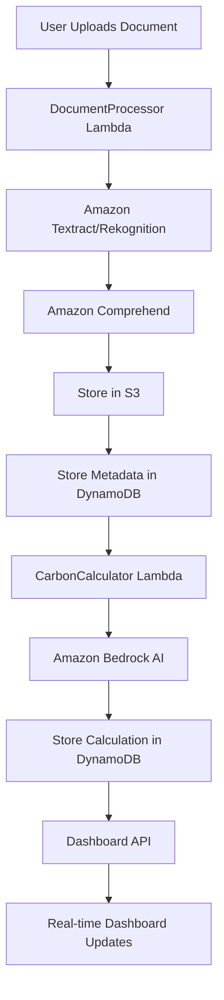

# CarbonLens AI - Data Storage Architecture

## 📊 **Complete Data Storage Overview**

The CarbonLens AI application uses a multi-tier AWS storage architecture to handle different types of data efficiently and cost-effectively.

---

## 🗄️ **1. Primary Data Store: Amazon DynamoDB**

### **Table Name:** `carbonlens-ai-data-dev`

**Purpose:** Stores all processed information, metadata, and analysis results

### **Data Types Stored:**

#### **A. Document Processing Records**
```json
{
  "id": "uuid-document-id",
  "type": "document-processing",
  "documentType": "invoice|bill_of_lading|shipping_label|logistics_document",
  "fileName": "invoice.pdf",
  "extractedData": {
    "origin": "New York, NY",
    "destination": "Los Angeles, CA",
    "transportMode": "truck",
    "weight": 1500,
    "distance": 2445,
    "carrier": "FedEx",
    "trackingNumber": "1Z999AA1234567890"
  },
  "confidence": {
    "overall": 0.85,
    "origin": 0.9,
    "destination": 0.9,
    "weight": 0.85,
    "transportMode": 0.6
  },
  "processedAt": "2025-12-29T22:15:30.123Z",
  "createdAt": "2025-12-29T22:15:30.123Z"
}
```

#### **B. Carbon Calculation Records**
```json
{
  "id": "uuid-calculation-id",
  "type": "calculation",
  "data": {
    "documentId": "uuid-document-id",
    "carbonFootprint": {
      "totalEmissions": 156.75,
      "breakdown": {
        "transport": 135.0,
        "manufacturing": 13.5,
        "warehousing": 6.75,
        "lastMile": 20.25
      },
      "metadata": {
        "transportMode": "truck",
        "weight": 1500,
        "distance": 2445,
        "emissionFactor": 0.062,
        "origin": "New York, NY",
        "destination": "Los Angeles, CA"
      }
    },
    "aiInsights": {
      "insights": ["High emissions due to long distance transport"],
      "recommendations": ["Consider rail transport for 65% emission reduction"],
      "benchmarks": "Above industry average for this route",
      "sustainabilityScore": 6
    },
    "calculatedAt": "2025-12-29T22:15:35.456Z"
  },
  "createdAt": "2025-12-29T22:15:35.456Z"
}
```

#### **C. Certificate Records**
```json
{
  "id": "uuid-certificate-id",
  "type": "certificate",
  "data": {
    "certificateNumber": "CERT-2025-001234",
    "calculationId": "uuid-calculation-id",
    "emissions": 156.75,
    "verificationHash": "sha256-hash",
    "issuedAt": "2025-12-29T22:20:00.789Z"
  },
  "createdAt": "2025-12-29T22:20:00.789Z"
}
```

#### **D. Optimization Records**
```json
{
  "id": "uuid-optimization-id",
  "type": "optimization",
  "data": {
    "calculationId": "uuid-calculation-id",
    "recommendations": [
      {
        "type": "transport_mode",
        "current": "truck",
        "suggested": "rail",
        "emissionReduction": 65,
        "costImpact": "neutral"
      }
    ],
    "generatedAt": "2025-12-29T22:18:00.000Z"
  },
  "createdAt": "2025-12-29T22:18:00.000Z"
}
```

---

## 📁 **2. File Storage: Amazon S3**

### **Bucket Name:** `carbonlens-ai-docs-dev-790756194179`

**Purpose:** Stores original uploaded documents for future reference and audit trails

### **Storage Structure:**
```
carbonlens-ai-docs-dev-790756194179/
├── processed/
│   ├── {document-id-1}/
│   │   ├── invoice.pdf
│   │   └── metadata.json
│   ├── {document-id-2}/
│   │   ├── shipping-label.png
│   │   └── metadata.json
│   └── ...
└── temp/
    └── (temporary processing files)
```

### **File Storage Details:**
- **Path Pattern:** `processed/{documentId}/{fileName}`
- **Content Types:** PDF, PNG, JPEG, JPG
- **Max File Size:** 10MB per file
- **Retention:** Permanent (for audit and compliance)
- **Access:** Private (Lambda functions only)

---

## 🔄 **3. Data Flow Architecture**

### **Document Upload → Processing → Storage Flow:**



### **Step-by-Step Data Storage:**

1. **Document Upload**
   - Original file → S3 bucket (`processed/{documentId}/{fileName}`)
   - File metadata → DynamoDB (document-processing record)

2. **AI Processing**
   - Extracted text and data → DynamoDB (extractedData field)
   - Confidence scores → DynamoDB (confidence field)

3. **Carbon Analysis**
   - Carbon footprint calculations → DynamoDB (calculation record)
   - AI insights and recommendations → DynamoDB (aiInsights field)

4. **Dashboard Data**
   - Aggregated metrics → Generated from DynamoDB queries
   - Real-time updates → Fetched via `/dashboard` API endpoint

---

## 📈 **4. Data Retrieval & Analytics**

### **Dashboard Data Sources:**
- **Total Emissions:** Sum from all calculation records
- **Documents Processed:** Count of document-processing records
- **Emissions Trend:** Monthly aggregation of calculation records
- **Transport Mode Distribution:** Analysis of transportMode from calculations
- **Recent Activities:** Latest records sorted by createdAt

### **API Endpoints for Data Access:**
- `GET /dashboard` - Aggregated dashboard metrics
- `POST /process-document` - Creates document-processing record
- `POST /calculate-carbon` - Creates calculation record
- `POST /certificate` - Creates certificate record
- `GET /optimizations` - Retrieves optimization records

---

## 🔒 **5. Data Security & Compliance**

### **Access Control:**
- **DynamoDB:** IAM roles restrict access to Lambda functions only
- **S3:** Private bucket with Lambda-only access
- **API Gateway:** CORS enabled for frontend domain only

### **Data Encryption:**
- **At Rest:** DynamoDB and S3 use AWS managed encryption
- **In Transit:** HTTPS/TLS for all API communications
- **Processing:** Temporary data encrypted in Lambda memory

### **Data Retention:**
- **DynamoDB:** Permanent storage for audit trails
- **S3:** Permanent storage for compliance
- **Lambda Logs:** 30-day retention in CloudWatch

---

## 💰 **6. Cost Optimization**

### **AWS Free Tier Usage:**
- **DynamoDB:** 25GB storage + 25 WCU/RCU (sufficient for thousands of documents)
- **S3:** 5GB storage (500+ documents at 10MB each)
- **Lambda:** 1M requests + 400,000 GB-seconds compute time
- **API Gateway:** 1M API calls per month

### **Storage Efficiency:**
- **JSON Compression:** Nested data stored as JSON strings
- **Selective Storage:** Only essential data stored in DynamoDB
- **S3 Lifecycle:** Could implement archival policies for old documents

---

## 🔍 **7. Data Monitoring & Maintenance**

### **CloudWatch Metrics:**
- DynamoDB read/write capacity utilization
- S3 storage usage and request metrics
- Lambda function duration and error rates
- API Gateway request counts and latency

### **Backup Strategy:**
- **DynamoDB:** Point-in-time recovery enabled
- **S3:** Versioning enabled for document protection
- **Cross-Region:** Could implement for disaster recovery

---

## 📊 **8. Sample Data Queries**

### **Get All Documents for a User:**
```javascript
// Scan DynamoDB for document-processing records
const params = {
  TableName: 'carbonlens-ai-data-dev',
  FilterExpression: '#type = :type',
  ExpressionAttributeNames: { '#type': 'type' },
  ExpressionAttributeValues: { ':type': { S: 'document-processing' } }
};
```

### **Calculate Total Emissions:**
```javascript
// Scan for all calculation records and sum emissions
const params = {
  TableName: 'carbonlens-ai-data-dev',
  FilterExpression: '#type = :type',
  ExpressionAttributeNames: { '#type': 'type' },
  ExpressionAttributeValues: { ':type': { S: 'calculation' } }
};
```

### **Get Monthly Emissions Trend:**
```javascript
// Query calculations by date range and group by month
const startDate = new Date(Date.now() - 6 * 30 * 24 * 60 * 60 * 1000);
// Filter by createdAt timestamp and aggregate
```

---

This architecture provides a scalable, cost-effective, and secure foundation for the CarbonLens AI application while maintaining full audit trails and enabling real-time analytics.